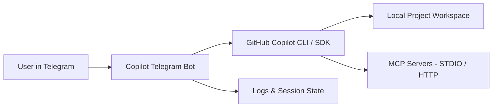
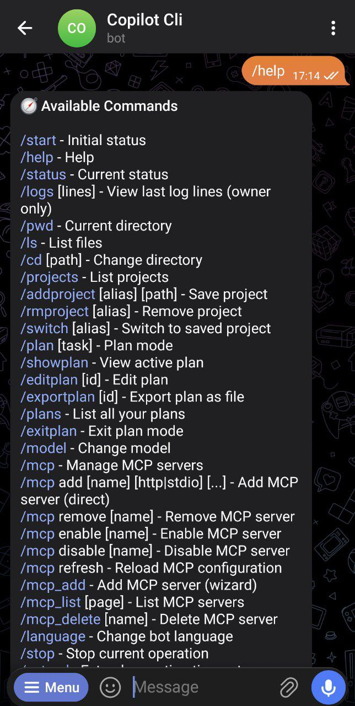
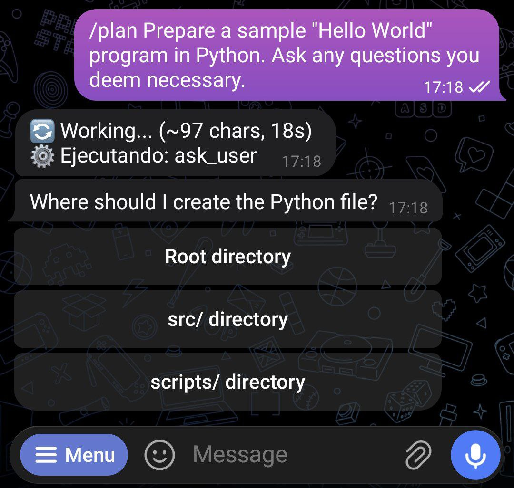
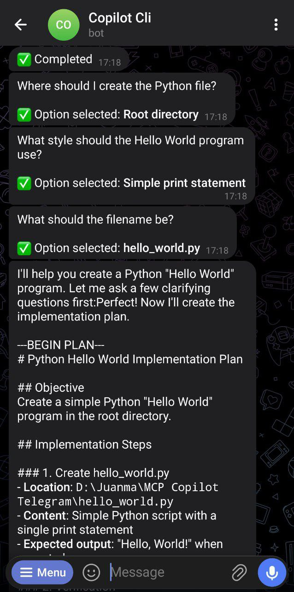

# Copilot Telegram Bot

[](https://nodejs.org/)
[](https://opensource.org/licenses/Apache-2.0)
[](https://www.typescriptlang.org/)

> Remote-first operational control layer for GitHub Copilot CLI via Telegram.

This project runs locally on your machine and exposes a controlled Telegram interface for interacting with your Copilot CLI session.

⚠️ This bot executes actions against your local workspace. Use only in trusted environments and review security settings carefully.

## ❓ Why this project?

GitHub Copilot CLI is great in-terminal, but this project adds a **remote operational layer** for moments when you are not at your desk.

Use this when you need to:
- Run and supervise coding tasks from mobile/Telegram.
- Keep a controlled workflow with approval steps via **Plan Mode**.
- Operate with explicit guardrails (path allowlists, owner permissions, executable allowlists, timeouts).
- Extend workflows through MCP servers without leaving your chat interface.

### Why use this instead of regular Copilot CLI usage?

- **Regular Copilot CLI:** local-first, interactive terminal flow.
- **Copilot Telegram Bot:** remote-first control, operational visibility, and approval-oriented execution from Telegram.

Both are complementary: this bot is designed for remote execution, monitoring, and controlled delegation.

## 👤 Deployment Scope

Designed for controlled **single-user** environments.
It is not designed for public multi-tenant deployment without additional hardening.

## 🧩 Real Use Cases

- **Remote coding supervision:** launch and monitor tasks while away from your workstation.
- **Mobile-first triage:** review logs/status and unblock issues quickly from Telegram.
- **Plan approval workflow:** generate implementation plans and explicitly approve before execution.
- **Cross-repo operations:** switch projects and control MCP-enabled workflows in one place.

## ✨ Features

- 🤖 **GitHub Copilot Integration** - Powered by official `@github/copilot-sdk`
- 📱 **Telegram Bot Interface** - Control Copilot remotely via grammY bot framework
- 🔌 **MCP Server Support** - Model Context Protocol integration (STDIO & HTTP)
- 🔒 **Security Features** - Path allowlist, executable validation, data sanitization
- 🎯 **Plan Mode** - Generate implementation plans and explicitly approve them before execution ⚡
- 🌐 **Cross-Platform** - Windows, Linux, macOS support

## 🔐 Security Philosophy

This project is designed around explicit control and guardrails:
- Path allowlists
- Owner-based permissions
- Executable allowlists
- Time-bounded operations

## 📌 Project Status

- Actively maintained
- Production-usable for controlled environments
- Open to feedback and contributions

## 🏗️ Architecture (high-level)



## 🖼️ Product Walkthrough 

### 1) Help command



### 2) Plan mode + ask_user flow



### 3) Plan completion message



## 🚀 Quick Start

### Prerequisites

- **Node.js** >= 18.0.0
- **GitHub Copilot** subscription (required)
- **Telegram Bot Token** from [@BotFather](https://t.me/BotFather)
- **Copilot CLI** installed globally:
  ```bash
  npm install -g @github/copilot
  copilot
  # Then run: /login
  ```

### Installation

```bash
# Clone repository
git clone https://github.com/Rios-Guerrero-Juan-Manuel/copilot-telegram-bot.git
cd copilot-telegram-bot

# Install dependencies
npm install

# Configure environment (Linux/macOS)
cp .env.example .env
# Edit .env with your credentials
```

```powershell
# Configure environment (Windows PowerShell)
Copy-Item .env.example .env
# Edit .env with your credentials
```

### Global installation (CLI)

```bash
# Install globally from npm
npm install -g @juan-manuel-rios-guerrero/copilot-telegram-bot

# Run the bot CLI
copilot-telegram-bot
```

### Configuration

Create a `.env` file with the following:

```env
# Required
TELEGRAM_BOT_TOKEN=your_bot_token_from_botfather
TELEGRAM_CHAT_ID=your_telegram_user_id

# Paths
DEFAULT_PROJECT_PATH=/path/to/your/project
ALLOWED_PATHS=/path/to/your/project,/other/allowed/path

# Optional (see .env.example for full list)
LOG_LEVEL=info
COPILOT_OPERATION_TIMEOUT=1200000
```

### Running

```bash
# Development mode (auto-reload)
npm run dev

# Production mode
npm start

# Build TypeScript
npm run build

# Run tests
npm test
```

## 📦 Available npm Scripts

### Development & Build
```bash
npm run dev          # Development mode with auto-reload
npm start            # Production mode
npm run build        # Compile TypeScript
npm run lint         # Run ESLint
npm run setup        # Initial setup (.env + install)
```

### Testing
```bash
npm test                      # Full test suite
npm run test:coverage         # Tests with coverage report
npm run test:e2e              # End-to-end integration tests
npm run test:security         # Security tests
npm run test:all-checks       # Type check + full test suite
npm run test:regression       # Regression test suite
npm run test:regression:coverage  # Regression tests with coverage
```

For Unix systems, additional setup scripts are available in `scripts/`:
- `./scripts/setup.sh` - Quick project setup
- `./scripts/install-mcp.sh` - Interactive MCP server configuration
- `./scripts/setup-mcp-example.sh` - Quick MCP setup

## 📚 Documentation

- **[Full Setup Guide](SETUP.md)** - Detailed installation and configuration
- **[Contributing Guide](CONTRIBUTING.md)** - Development guidelines and best practices

## 📋 Commands Reference

### Information Commands

| Command | Description |
|---------|-------------|
| `/start` | Initialize bot and show current status |
| `/help` | Display available commands |
| `/status` | Show current model, project, and active sessions |
| `/logs [n]` | View last n lines of logs (owner only) |
| `/language` | Change bot language |

### Navigation & Projects

| Command | Description | Interactive Mode |
|---------|-------------|------------------|
| `/pwd` | Print current working directory | - |
| `/ls` | List files in current directory | - |
| `/cd [path]` | Change directory (or start wizard) | ✅ Interactive navigation |
| `/allowpath <path>` | Add allowed path (admin only) | - |
| `/projects` | List saved projects | - |
| `/addproject [alias] [path]` | Save project (or start wizard) | ✅ Step-by-step guidance |
| `/rmproject <alias>` | Remove saved project | - |
| `/switch [alias]` | Switch to saved project | ✅ Interactive menu |

### Copilot & Model

| Command | Description |
|---------|-------------|
| `/plan <task>` | Start plan mode (interactive approval) |
| `/showplan` | Show active plan |
| `/editplan [id]` | Export plan as editable file and wait for updated `.md` upload |
| `/exportplan [id]` | Export plan as `.md` file |
| `/plans` | List saved plans |
| `/exitplan` | Exit plan mode |
| `/model` | Change LLM model (interactive menu) |
| `/stop` | Cancel current operation |
| `/extend` | Extend operation timeout |
| `/new_chat` | Start a clean chat session |
| `/reset` | Alias for `/new_chat` |

### MCP Servers

| Command | Description |
|---------|-------------|
| `/mcp` | List MCP servers and quick actions |
| `/mcp add <name> <http\|stdio> <url\|command> [args...]` | Add MCP server directly (non-wizard mode) |
| `/mcp remove <name>` | Remove MCP server |
| `/mcp enable <name>` | Enable MCP server |
| `/mcp disable <name>` | Disable MCP server |
| `/mcp refresh` | Reload MCP configuration |
| `/mcp_add` | Add MCP server (interactive wizard) |
| `/mcp_list [page]` | List servers with pagination |
| `/mcp_delete <name>` | Delete MCP server |

### Examples

```bash
# Simple question
"What is the purpose of this function?"

# Complex task
"/plan Implement OAuth2 authentication with Google sign-in"

# Navigate to project
/cd /path/to/my/project

# Or use interactive wizard
/cd
# Then click through directories

# Add project with wizard
/addproject
# Follow step-by-step guidance

# Switch models
/model
# Select from interactive menu
```

## ⚙️ Configuration

### Environment Variables

All configuration is done via `.env` file. See `.env.example` for complete list.

#### Required

```env
TELEGRAM_BOT_TOKEN=your_bot_token           # From @BotFather
TELEGRAM_CHAT_ID=your_telegram_user_id      # From @userinfobot
DEFAULT_PROJECT_PATH=/path/to/project       # Default working directory
ALLOWED_PATHS=/path1,/path2                 # Security: allowed directories
```

#### Security Settings

```env
# Path allowlist (comma-separated)
ALLOWED_PATHS=/home/user/projects,/opt/apps

# MCP executable allowlist (comma-separated)
ALLOWED_MCP_EXECUTABLES=npx,node,python,python3

# Owner permissions
ALLOWED_TELEGRAM_IDS=123456789,987654321
```

#### Timeouts & Retries

```env
# Operation timeout (default: 20 minutes)
COPILOT_OPERATION_TIMEOUT=1200000

# User response timeout (default: 5 minutes)
ASK_USER_TIMEOUT=300000

# Network retry settings
TELEGRAM_RETRY_INITIAL_DELAY_MS=1000
TELEGRAM_RETRY_MAX_DELAY_MS=32000
```

#### Logging

```env
# Log level: debug | info | warn | error
LOG_LEVEL=info

# Rotation settings
LOG_MAX_SIZE=20m
LOG_MAX_FILES=14d
LOG_DIR=./logs
```

### MCP Server Configuration

MCP servers are configured per-user in the SQLite database. Use the `/mcp_add` wizard or manually edit:

**STDIO Server Example:**
```json
{
  "type": "stdio",
  "command": "npx",
  "args": ["-y", "@modelcontextprotocol/server-filesystem", "/allowed/path"]
}
```

**HTTP Server Example:**
```json
{
  "type": "http",
  "url": "https://api.example.com/mcp/"
}
```

## 🌐 Platform Support

Compatible with Windows, Linux, and macOS. Requires Node.js >= 18.0.0.

CI validates on all three platforms:
- install/build/test
- `better-sqlite3` smoke test
- npm package install + CLI command startup smoke (`copilot-telegram-bot`)

See [SETUP.md](SETUP.md) for platform-specific installation instructions.

## 🤖 Supported Models

Use `/model` command to select from available models (GPT-4, Claude, Gemini, etc.).

**Note:** Available models depend on your GitHub Copilot subscription.


## 🐛 Troubleshooting

### Common Issues

**Bot doesn't start:**
```bash
# Check logs (Linux/macOS)
cat logs/error-*.log | tail -n 50

# Verify environment variables (Linux/macOS)
cat .env

# Test Copilot CLI
copilot
# Run: /login
```

```powershell
# Check logs (Windows PowerShell)
Get-Content -Path logs\error-*.log -Tail 50

# Verify environment variables (Windows PowerShell)
Get-Content .env

# Test Copilot CLI
copilot
# Run: /login
```

**Copilot CLI not authenticated:**
```bash
copilot
# Run: /login
```

**Path permission errors:**
- Verify `ALLOWED_PATHS` includes the directory
- Check `DEFAULT_PROJECT_PATH` exists
- Use absolute paths only

See [SETUP.md](SETUP.md) for detailed troubleshooting.


## 🤝 Contributing

See [CONTRIBUTING.md](CONTRIBUTING.md) for guidelines.

## 📄 License

Apache 2.0 - see [LICENSE](LICENSE) file.
